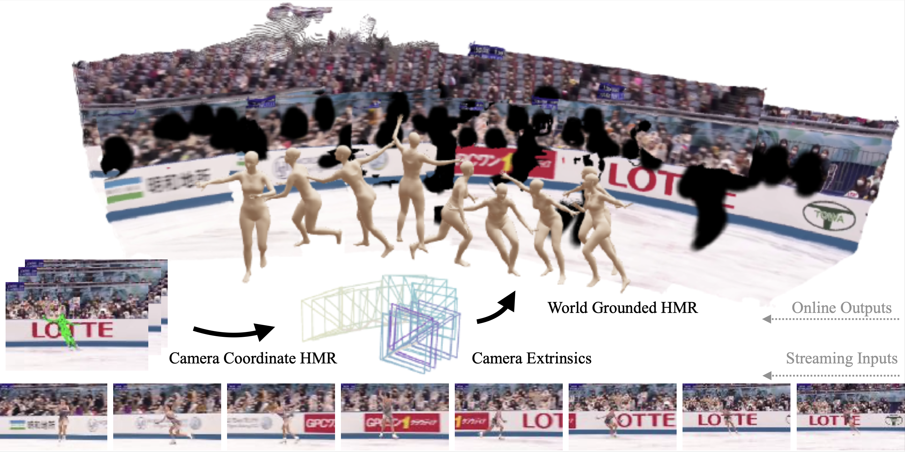
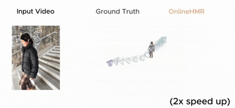

# OnlineHMR: Video-based Online World-Grounded Human Mesh Recovery
<div align="center">
	<a href="https://arxiv.org/abs/2603.17355"></a>
	<a href="https://tsukasane.github.io/Video-OnlineHMR/"></a>
    
</div>

-- --
<div align="center">
  
  
</div>

## Installation
1. Clone this repo with the `--recursive` flag (Please follow the corresponding licenses of thirdparty models). 
    ```Bash
    git clone --recursive https://github.com/Tsukasane/Video-OnlineHMR.git
    ```

2. Creating a new anaconda environment.
    ```Bash
    # Base environment installation
    conda create -n onlinehmr python=3.11.5 cmake
    conda activate onlinehmr
    
    # if run on cluster, first decide which pair of CUDA and gcc to use, for example:
    module spider cuda-toolkit
    module load cuda/12.4.0
    module spider gcc
    module load gcc/13.2.1-p20240113

    # then install the corresponding torch...
    pip install torch==2.5.1 torchvision==0.20.1 torchaudio==2.5.1 --index-url https://download.pytorch.org/whl/cu124
    pip install --no-build-isolation git+https://github.com/mattloper/chumpy.git
    pip install -r requirements.txt
    cd thirdparty

    # MASt3R-SLAM installation
    cd MASt3R-SLAM/
    git submodule update --init --recursive
    pip install --no-build-isolation -e thirdparty/mast3r
    pip install thirdparty/in3d
    pip install --no-build-isolation -e .
    pip install torchcodec==0.1

    # Detectron2 installation
    pip install --no-build-isolation 'git+https://github.com/facebookresearch/detectron2.git@a59f05630a8f205756064244bf5beb8661f96180'

    # pytorch3d installation
    pip install --no-build-isolation "git+https://github.com/facebookresearch/pytorch3d.git@stable"

    # MoGe installation
    pip install git+https://github.com/microsoft/MoGe.git

    # DEVA installation
    cd ../Tracking-Anything-with-DEVA
    pip install -e .

    cd ../..
    ```

3. Prepare data and models
    
    Register at [SMPLify](https://smplify.is.tue.mpg.de) and [SMPL](https://smpl.is.tue.mpg.de), whose usernames and passwords will be used by our script to download the SMPL models. Run the following to fetch all models and checkpoints to `data/`. Thirdparty models include [MASt3r-SLAM checkpoints](https://github.com/rmurai0610/MASt3R-SLAM/tree/c3d0d5b67bf51d558d7640ff6032407f68041f92?tab=readme-ov-file#installation), [HMR2.0b checkpoints](https://github.com/shubham-goel/4D-Humans), [MoGe-v2 checkpoints](https://github.com/microsoft/moge).
    ```Bash
    bash scripts/download_models.sh
    bash scripts/download_extra.sh
    ```

4. Check repo structure

* The pretrained models and templates are placed at
    ```
    checkpoints/
    └── MASt3R_ViTLarge*
    data/
    └── pretrain/
        └── hmr2b/
            └── epoch=35-step=1000000.ckpt
        ├── camcalib_sa_biased_l2.ckpt
        ├── cascade_mask_rcnn_vitdet_h_75ep.py
        ├── DEVA-propagation.pth
        ├── mogev2_model.pt
        ├── sam_vit_h_4b8939.pth
    └── smpl/
        ├── J_regressor_extra.npy
        ├── J_regressor_h36m.npy
        ├── kintree_table.pkl
        ├── SMPL_FEMALE.pkl
        ├── SMPL_MALE.pkl
        ├── smpl_mean_params.npz
        └── SMPL_NEUTRAL.pkl
    └── colors.txt
    └── pascal_occluders.pkl
    ```

* Data organization
    ```
    ./datasets
        |--3dpw
        |--bedlam_30fps
        |--dataset_ann
        |--emdb
        |--h36m
        |--training_data
    ```
* Reset ``ROOT`` and ``DATASET_NPZ_PATH`` in ``./data_config.py`` to your own folders.

## Run demo on videos
```bash
# download examples
gdown --folder https://drive.google.com/drive/folders/17oVcqoa0xUSs35fSfUTvCOqMjKrfo8_O?usp=sharing

# inference
python ./scripts/run_custom.py --video <YOUR/VIDEO/PATH>.mp4 --no-viz --calib false --depth-mask

# inference w tracking (multipersons)
python ./scripts/run_custom_mt.py --video <YOUR/VIDEO/PATH>.mp4 --no-viz --calib false --depth-mask
```
Results are saved to
* ``./res_human_camera/global_results`` (global optimized scene).
* ``./res_human_camera/{trackID}_{videoName}*.npz`` (camera coordinate human motion).
* ``./logs/*_images_incremental_all.txt`` (incremental camera extrinsics).
```bash
# visualization
python visualize_viser.py --human_npz_path <HUMAN/NPZ/PATH>.npz --camera_path <CAMERA/TXT/PATH>.txt
```
You can also use scripts under ``vis_tools/`` to check visualization in ``.gif`` format.

The projected result on image can be visualized by 
```bash
python scripts/visualize_smpl_projection.py \
        --image_dir results/<videoName>/images \
        --camera_txt logs/<videoName>_images_incremental_all.txt \
        --smpl_npz res_human_camera/<personID>_<videoName>.npz \
        --output_dir vis_smpl_projection \
        --draw_mesh
```

## Training
```Bash
# Fine-tune a online camera coordinates HMR model based on HMR2.0
python train.py --cfg configs/config_vimo.yaml
```
The training log and output will be placed at ``./results``. Set ``self.visualize_spec=True`` in ``./lib/utils/pose_utils.py`` if you want to visualize the 3D joint spectrogram.

## Evaluation
For camera coordinate evaluation, you can keep the current config, then run the above training script. Before starting the resumed training, the eval code will run on the checkpoint you downloaded before and produce camera coordinate metrics.
```Bash
# cam traj eval
python ./scripts/emdb/cam_only_eval.py --camera_root results/emdb2_results/camera

# world coords HMR eval
python ./scripts/emdb/run_eval_mast3r_slam.py --split 2 --human_rootdir results/emdb2_results/human --camera_rootdir results/emdb2_results/camera
```

## Acknowledgement
We thank [TRAM](https://github.com/yufu-wang/tram/tree/main), [GVHMR](https://github.com/zju3dv/GVHMR?tab=readme-ov-file), [Human3R](https://github.com/fanegg/Human3R/tree/a2959bb667d29f6bb2d1c7ee40df57aa258a1537) for their code, [3DPW](https://virtualhumans.mpi-inf.mpg.de/3DPW/), [H3.6M](http://vision.imar.ro/human3.6m/description.php), [BEDLAM](https://bedlam.is.tue.mpg.de/), [EMDB](https://eth-ait.github.io/emdb/) for data, and [Viser](https://viser.studio/main/) for awesome visualization tool.